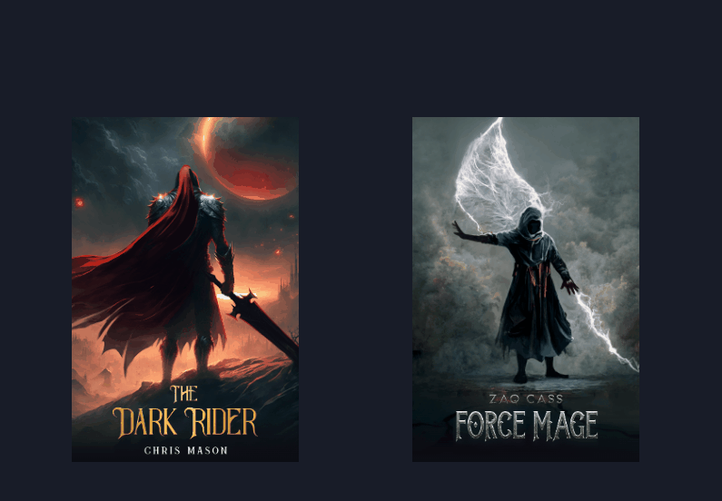

# Tarjetas con Efecto 3D y Hover

Este proyecto implementa tarjetas interactivas con efecto 3D y animaciones en CSS al pasar el cursor.

## 🖼️ Vista Previa



## 📂 Estructura del Proyecto

```
📁 Proyecto
│── 📁 img
│   │── dark_rider-cover.jpg
│   │── dark_rider-title.png
│   │── dark_rider-character.webp
│   │── force_mage-cover.jpg
│   │── force_mage-title.png
│   │── force_mage-character.webp
│── index.html
│── styles.css
│── README.md
```

## 🚀 Tecnologías Utilizadas
- HTML5
- CSS3

## 📋 Descripción del Código

### HTML (`index.html`)
- Se crean tarjetas con imágenes de fondo, títulos y personajes.
- Se usan enlaces `<a>` para redirigir a una URL al hacer clic en la tarjeta.
- Cada tarjeta contiene una estructura con:
  - `cover-image`: Imagen de fondo.
  - `title`: Imagen del título.
  - `character`: Imagen del personaje que aparece al pasar el cursor.

### CSS (`styles.css`)
- Se utilizan variables CSS para definir tamaños de tarjeta.
- Se aplican efectos `hover` para animaciones 3D en las tarjetas.
- Uso de `perspective` y `transform` para lograr la ilusión de profundidad.

## 📥 Cómo Clonar el Proyecto

```sh
git clone https://github.com/lenninIbarrraGonzalez/3dcard
cd 3dcard
```


## 📜 Licencia
Este proyecto está bajo la licencia MIT.
